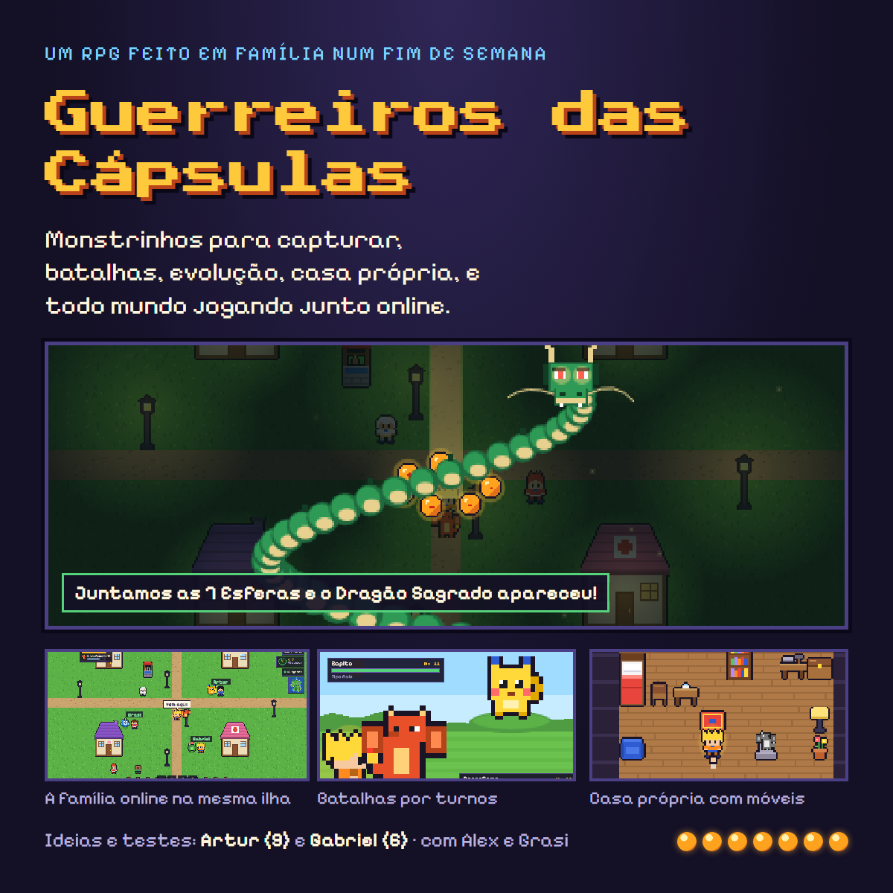
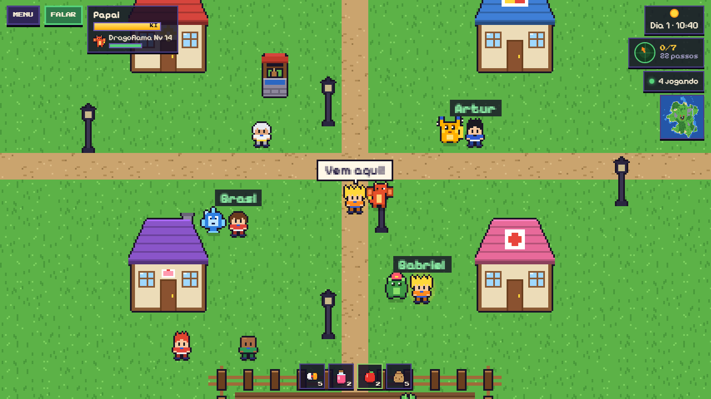
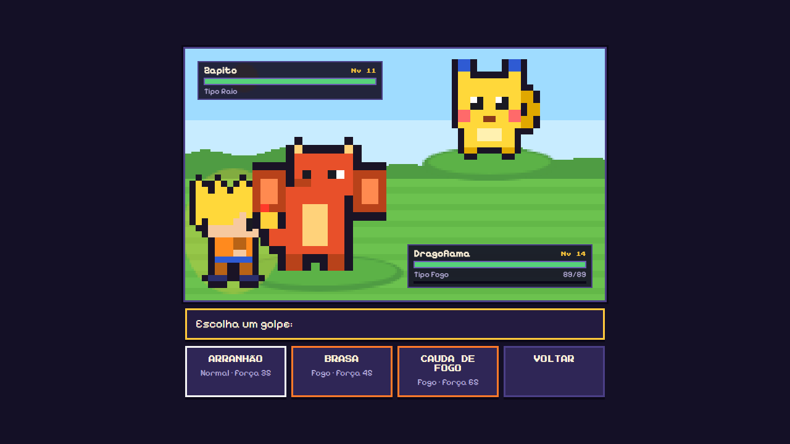
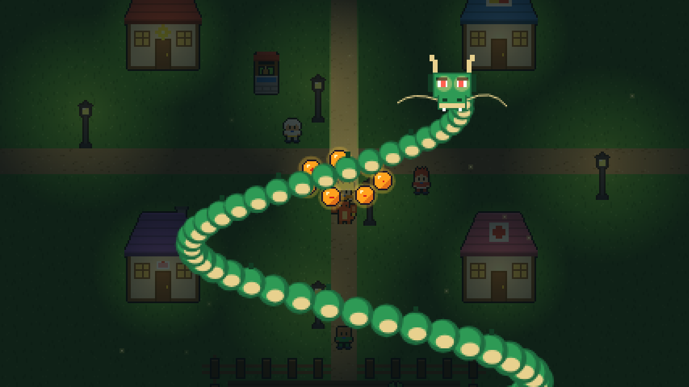
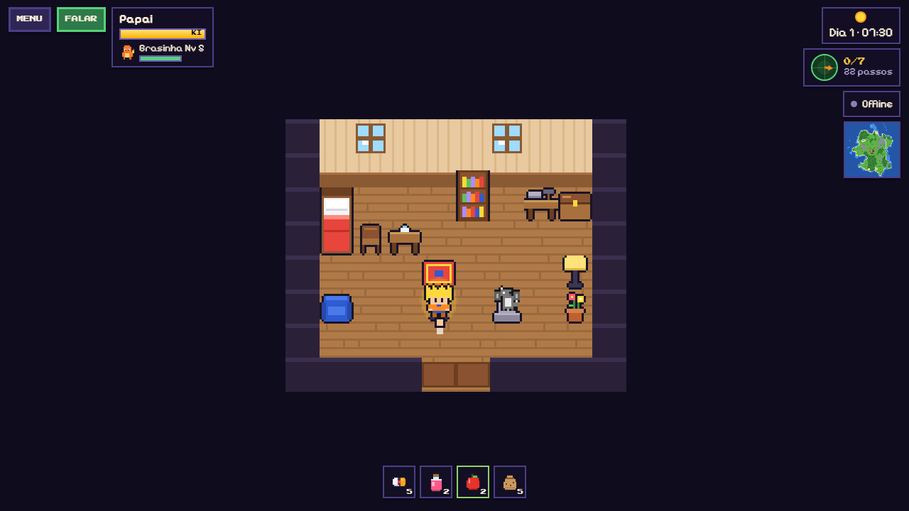
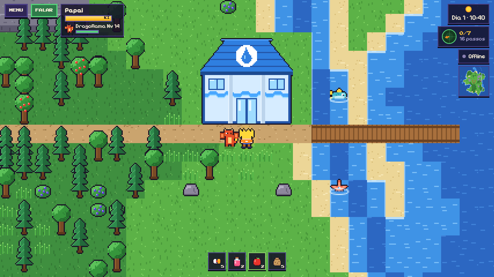
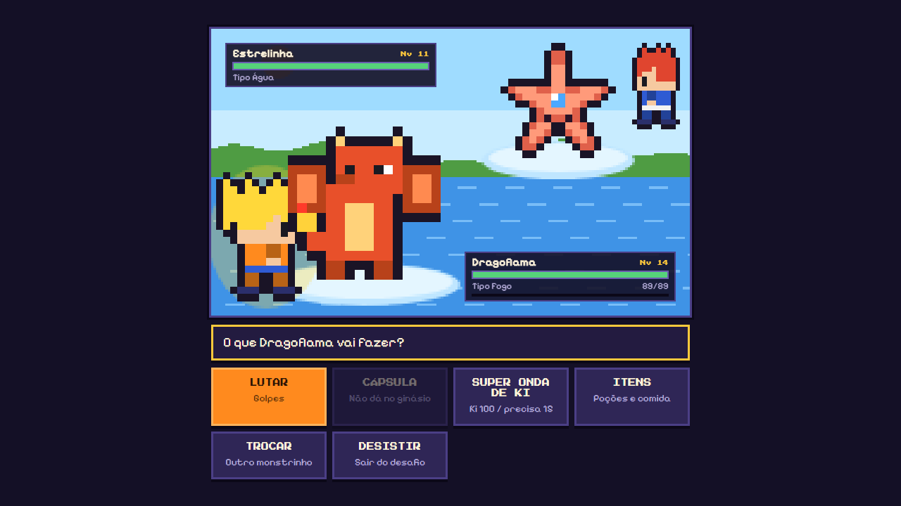
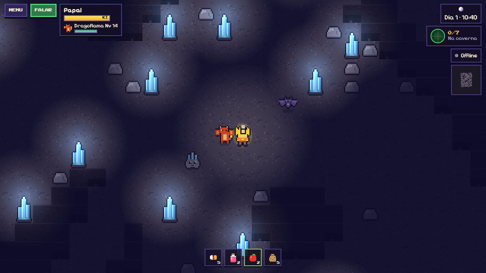
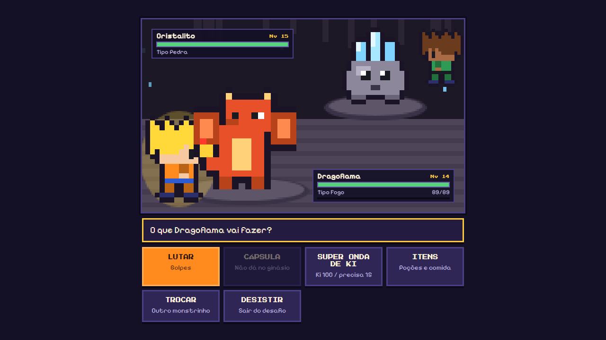

# Guerreiros das Cápsulas

<b><a href="https://alexpernaoficial.github.io/guerreiros-das-capsulas/">▶ Jogar agora (no navegador, no computador ou no celular)</a></b>

Um RPG pixelado criado **em família, num fim de semana**, pelo Alex, pela Grasi, pelo **Artur (9 anos)** e pelo **Gabriel (6 anos)**. A ideia foi dos meninos: misturar o estilo de guerreiros de desenho animado com monstrinhos para capturar, num mundo aberto com natureza, dia e noite, vilas e aventuras. E o melhor de tudo: jogar todo mundo junto.

## A história

Tudo começou com uma pergunta das crianças: *"dá para fazer um jogo nosso?"*. Em vez de só jogar, sentamos juntos para **inventar**. Cada um teve um papel:

- **Artur (9):** diretor de criaturas. Pensou nos monstrinhos, nos tipos (fogo, água, planta, raio...) e em quem vence quem.
- **Gabriel (6):** diretor de arte e testador oficial. Escolheu cores, testou cada fase e achou os "bugs" (e pediu um ratinho elétrico!).
- **Alex e Grasi:** produtores. Organizaram as ideias, decidiram as regras e jogaram junto.

O jogo foi programado com a ajuda do **Claude** (IA da Anthropic) como parceiro de desenvolvimento: a família descrevia o que queria, testava e pedia melhorias, fase por fase, até todo mundo estar jogando online no celular.

## O que tem no jogo

| | |
|---|---|
|  |  |
| **Mundo da Família:** todos na mesma ilha, com nomes, balões de fala e o monstrinho líder seguindo cada um | **Batalhas por turnos** com tipos, golpes e a Onda de Ki do guerreiro |
|  |  |
| **O Dragão Sagrado** aparece quando você junta as 7 Esferas e realiza um desejo | **Casa própria** com cama, baú e bancada para construir móveis |
|  |  |
| **Ginásio de Água** na beira do rio, com peixes e estrelas nadando | **Desafio da Líder Marina** na arena de água |
|  |  |
| **Caverna das Pedras**, escura e cheia de cristais e morcegos | **Desafio do Líder Rocco** no fundo da caverna |

- 🧑‍🎤 **Crie seu guerreiro:** cabelo, cores, roupa e faixa.
- 🌍 **Mundo aberto gerado automaticamente:** rios, lagos, florestas, montanhas, vila e **ciclo de dia e noite**.
- 🍎 **Coleta e horta:** cortar árvores, quebrar pedras, colher frutas, plantar e colher cenouras.
- 🟠 **Monstrinhos originais:** capture com Cápsulas, treine, suba de nível e **evolua** (Brasinha → Dragoflama, Zapito → Zaptor...).
- ⚔️ **Batalhas** contra monstrinhos selvagens e **batalhas amistosas entre a família**.
- 🔄 **Troca de monstrinhos** entre os jogadores.
- 🐉 **7 Esferas do Dragão** escondidas pela ilha, com radar e três desejos possíveis.
- 🏠 **Casas:** a sua, para decorar, e a da Vovó Tuca, que deixa bolo todo dia.
- 🏊 **Nado** nos rios e lagos, onde vivem o **Barbatino** (peixe) e a **Estrelinha** (estrela-do-rio).
- 🏛️ **Ginásio de Água:** desafie a Líder **Marina** e ganhe a **Insígnia Gota**.
- 🦇 **Caverna das Pedras:** túneis escuros iluminados por cristais, com o **Cristalito** e o **Morceguinho** (tipo Voador), e o **Ginásio de Pedra** do Líder **Rocco** (Insígnia Rocha).
- 🗺️ **Mapinha** mostrando onde está cada pessoa da família.
- 🎵 **Música de fundo** composta em código, com uma trilha para o dia, a noite, as batalhas e o Dragão.

## Como jogar

**Computador:** setas ou WASD para andar · Espaço/E para ação · Shift para correr · Esc para o menu.
**Celular:** joystick na tela · botões AÇÃO e CORRER.

**Jogar junto online:** todos abrem o mesmo link e tocam em **Mundo da Família**. Para uma sala só da sua família, use um código no link:
`https://alexpernaoficial.github.io/guerreiros-das-capsulas/?sala=seucodigo`

Cada aparelho guarda o próprio jogo salvo.

## Como foi feito

- **Um único arquivo HTML** (`index.html`) com JavaScript puro: o mapa, os personagens e os monstrinhos são desenhados pixel a pixel em código, sem imagens externas.
- **Canvas 2D** para o mundo, a iluminação noturna e as batalhas.
- **Web Audio API** para a música e os efeitos sonoros, gerados em tempo real.
- **Firebase Realtime Database** com login anônimo para o modo online (regras de segurança em [`firebase-regras.json`](firebase-regras.json)).
- **GitHub Pages** para publicar o site.
- As batalhas entre jogadores usam um sorteio com a mesma "semente" nos dois aparelhos, para o resultado sair igual nas duas telas.

## O que as crianças aprenderam

- **Criatividade:** inventar personagens, nomes, tipos e poderes.
- **Lógica:** quem vence quem (fogo > planta > água > fogo), níveis, experiência e estratégia.
- **Leitura:** diálogos, missões e mensagens do jogo.
- **Testar e melhorar:** achar um problema, contar o que aconteceu e ver a correção chegar.
- **Trabalho em equipe:** trocar monstrinhos, batalhar e se ajudar pela ilha.

## Próximos passos

- Monstrinhos **desenhados pelo Artur e pelo Gabriel**.
- Mundo compartilhado de verdade (árvores e esferas iguais para todos).
- Chefões para enfrentar juntos.

---

Feito com carinho pela família Perna. 🐉✨
